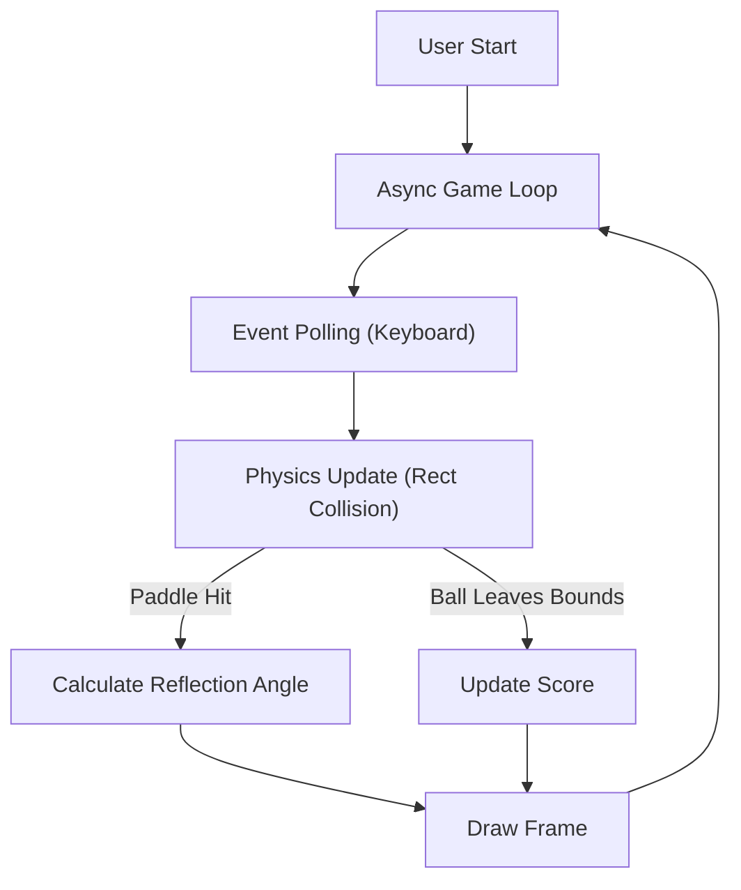

# Technical Specification: Pong Game

## Architectural Overview

**Pong Game** is a tabula-arcade simulation designed to demonstrate core game engine mechanics including collision physics, vector-based velocity, and AI tracking logic. The application serves as a digital study into early interactive system architecture, brought into a modern context via WebAssembly.

### Game Logic Flow

---

## Technical Implementations

### 1. Engine Architecture
-   **Core**: Built on **Pygame**, utilizing its optimized C-based backend for efficient sprite handling and collision detection.
-   **Loop Management**: Implements an asynchronous event loop (`asyncio`) to ensure compatibility with WebAssembly's non-blocking execution requirement.

### 2. Logic & Physics
-   **Collision Detection**: Uses Axis-Aligned Bounding Box (AABB) collision logic via `pygame.Rect.colliderect` to handle high-velocity ball-paddle interactions.
-   **AI Heuristics**: The opponent paddle tracks the ball's Y-coordinate with a defined velocity cap, creating a scalable difficulty curve based on reaction speed latency.
-   **Audio Engine**: Event-driven sound triggering (`pygame.mixer`) synchronized with physics events (collision, score).

### 3. Deployment Pipeline
-   **WebAssembly**: The project uses **Pygbag** to cross-compile the Python codebase into Wasm/JavaScript, allowing native execution in modern web browsers without plugins.
-   **CI/CD**: **GitHub Actions** handles the build process, converting assets and scripts into a static site structure deployed to **GitHub Pages**.

---

## Technical Prerequisites

-   **Runtime**: Modern WebAssembly-compliant browser (Chrome, Edge, Firefox).
-   **Development**: Python 3.11+ with `pygame` and `pygbag` installed.

---

*Technical Specification | Python | Version 1.0*

